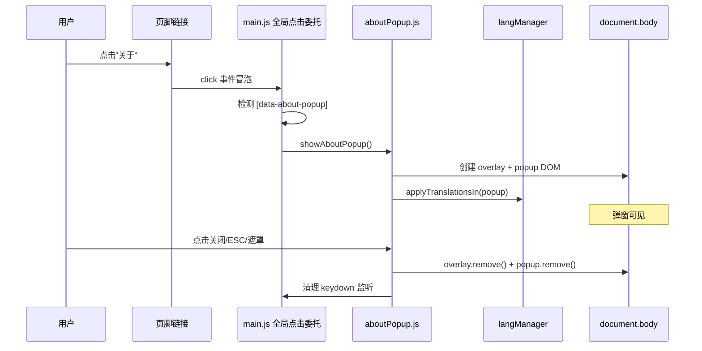
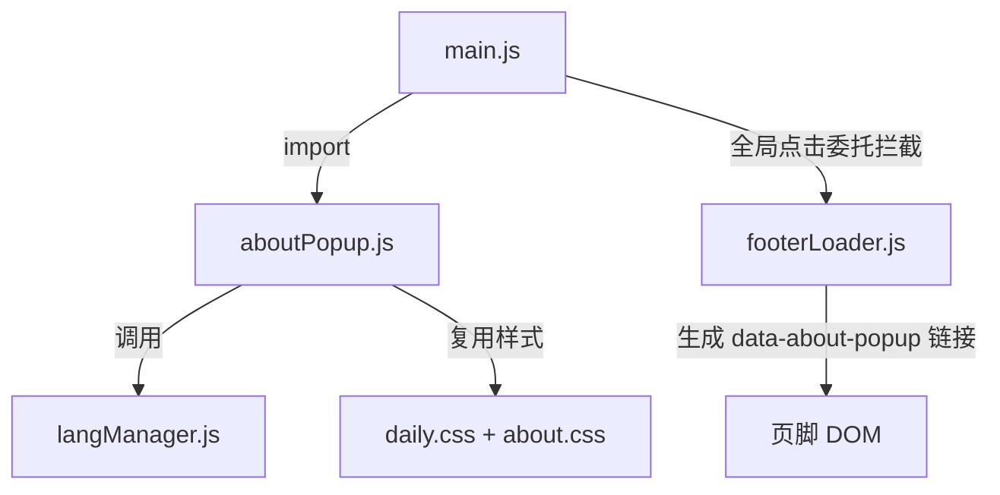

## 用户需求

将"关于"页面从独立窗口/页面导航模式改为弹窗模式显示。点击页脚的"关于"链接时，不再通过 PJAX 跳转到 `/page/about.html`，而是在当前页面原地拉起一个通用弹窗，交互方式与现有的每日弹窗（dailyPopup）和密码错误弹窗（password error popup）保持一致。

## 产品概述

在 Win98 复古风格网站中，将"关于"信息从独立页面切换为模态弹窗呈现，保持用户浏览上下文不中断，提供更流畅的信息查看体验。

## 核心功能

- 页脚"关于"链接点击后在当前页面弹出模态弹窗，不触发 PJAX 页面跳转
- 弹窗包含半透明遮罩层 + Win98 风格窗口，内容与原 About 页面一致（应用图标、自我介绍、致谢项目链接、密码入口快捷图标）
- 关闭方式与现有弹窗统一：确认按钮、标题栏关闭按钮、遮罩层点击、ESC 键
- 关闭后弹窗 DOM 从页面移除（采用密码错误弹窗的 `element.remove()` 模式）
- 弹窗内容支持多语言翻译（`data-lang-id`），弹窗打开时自动应用当前语言
- 弹窗内致谢链接在新窗口打开（`target="_blank"`），密码快捷图标点击关闭弹窗后正常 PJAX 导航
- 响应式适配：桌面端固定宽度 450px，移动端自适应 `max-width: calc(100vw - 32px)`

## 技术栈

- 原生 JavaScript (ES Module)
- 98.css (Win98 UI 框架)
- Webpack + EJS 构建体系
- langManager 多语言系统
- PJAX SPA 路由

## 实现方案

### 策略概述

新建独立的 `aboutPopup.js` 模块，采用与密码错误弹窗一致的 JS 动态 `createElement` 方式创建弹窗 DOM（而非 fetch HTML 文件），关闭时直接 `remove()` 移除 DOM。将页脚"关于"链接改为触发弹窗而非 PJAX 导航。

### 关键技术决策

**1. 弹窗创建方式：选择 `createElement` 动态创建**

- 参考 `password.js` 的 `showPasswordError()` 模式，而非 `dailyPopup.js` 的 fetch HTML 模式
- 理由：About 弹窗内容固定，无需额外网络请求；`createElement` 更直接，关闭时 `remove()` 干净无残留
- 每日弹窗的 `display:none` 隐藏方式会留下 DOM 残留，不适合可重复打开的场景

**2. 触发方式：拦截页脚链接点击**

- 修改 `footerLoader.js` 中页脚"关于"链接，将 `<a href="/page/about.html">` 改为带 `data-about-popup` 属性的按钮式链接
- 在 `aboutPopup.js` 中导出 `showAboutPopup()` 函数
- 在 `main.js` 的全局点击委托 `bindGlobalPjaxNavigation` 中，优先拦截 `[data-about-popup]` 点击，调用 `showAboutPopup()` 并阻止后续 PJAX 导航处理

**3. 弹窗 ID 与 CSS 复用**

- 弹窗 ID 使用 `#about-popup`，遮罩 ID 使用 `#about-popup-overlay`
- 将 `daily.css` 中现有的弹窗公共样式选择器扩展，加入 `#about-popup`，实现定位、阴影、滚动等样式复用
- 弹窗独有宽度 450px（与每日弹窗一致），在 `about.css` 中增加

**4. 多语言支持**

- 弹窗 DOM 使用 `data-lang-id` 属性标记
- 注入 body 后调用 `langManager.applyTranslationsIn(popup)` 对弹窗子树做增量翻译
- 无需全文档扫描，性能最优

**5. 弹窗内链接处理**

- 致谢项目的外部链接添加 `target="_blank"` + `data-no-pjax`，避免被 PJAX 拦截
- 密码快捷图标：点击时先关闭弹窗，然后通过已有的 `data-pjax-url` 机制触发 PJAX 导航

**6. 防重复打开**

- 打开前检测 `document.getElementById('about-popup')` 是否已存在，防止重复创建

### 性能与可靠性

- 无网络请求开销（纯 DOM 操作）
- 关闭时彻底移除 DOM + 清理 keydown 监听器，无内存泄漏
- 弹窗内 `stopPropagation` 防止点击穿透到遮罩层

## 实现备忘

- **复用现有模式**：严格对齐 `showPasswordError()` 的 overlay/popup/close 三件套模式，保持代码风格一致
- **弹窗内容中的链接**：外部链接必须加 `target="_blank"` 和 `data-no-pjax`，否则会被 `bindGlobalPjaxNavigation` 拦截导致 PJAX 错误
- **CSS 选择器扩展**：在 `daily.css` 中扩展公共弹窗选择器时，需同步扩展 `p` 样式、关闭按钮样式、响应式断点三处
- **About 独立页面保留**：`about.html` / `about.ejs` 暂时保留不删除，避免直接 URL 访问返回 404

## 架构设计

### 数据流



### 模块关系



## 目录结构

```
/Users/sheltonchu/Emanon/
├── js/
│   ├── aboutPopup.js      # [NEW] 关于弹窗模块。导出 showAboutPopup() 函数，负责动态创建遮罩+弹窗 DOM、绑定关闭事件（按钮/遮罩/ESC）、调用 langManager 翻译、关闭时 remove() 清理。弹窗内容包含应用图标、自我介绍(data-lang-id="about")、致谢项目(data-lang-id="thanks_project")、外部链接列表、密码快捷图标。需处理防重复打开、密码图标点击后关闭弹窗再导航。
│   ├── main.js             # [MODIFY] 新增 import aboutPopup；在 bindGlobalPjaxNavigation 的全局点击委托中，在 PJAX 链接处理之前增加 [data-about-popup] 检测分支，调用 showAboutPopup() 并 preventDefault + return 阻止后续处理。
│   └── footerLoader.js     # [MODIFY] 将页脚"关于"链接从 <a href="/page/about.html"> 改为 <a href="#" data-about-popup data-no-pjax data-lang-id="about_title">，添加 data-about-popup 标记供全局委托识别，data-no-pjax 防止 PJAX 拦截兜底。
├── css/
│   ├── daily.css           # [MODIFY] 扩展弹窗公共样式选择器，将 #about-popup 加入 #welcome-popup 和 #password-error-popup 的并列选择器中（定位、阴影、max-height、overflow-y、user-select、p样式、关闭按钮样式、响应式断点）。
│   └── about.css           # [MODIFY] 新增 #about-popup 独有样式：宽度 450px；弹窗内图标容器样式；弹窗内 .about-shortcuts 样式适配；移动端响应式宽度覆盖。保留原有 table 和 .about-shortcuts 样式不变。
└── ejs/
    └── pages/about.ejs     # [保留] 不做修改，保留独立页面作为直接 URL 访问的兜底
```

## 关键代码结构

```typescript
// js/aboutPopup.js - 核心接口
export function showAboutPopup(): void;
// 创建 overlay + popup DOM，注入 body，绑定关闭事件，调用 langManager 翻译
// 关闭时 remove() 清理 DOM + keydown 监听器
// 防重复：若 #about-popup 已存在则直接 return
```

## Agent Extensions

### SubAgent

- **code-explorer**
- 用途：在实现过程中验证现有代码模式和依赖关系，确保修改不影响其他功能
- 预期结果：精确定位所有需要修改的代码行，验证弹窗 CSS 选择器扩展的完整性