## 用户需求

基于 CSS 移动端优化专项审查报告，对 Emanon 项目（Win98 复古风格个人网站）的全部 10 个 CSS 源文件进行移动端适配优化。

## 产品概述

Emanon 是一个桌面优先的 Windows 98 复古风格网站，当前 CSS 在移动端存在多项体验问题：缺少响应式断点、触摸目标过小、字号过小导致阅读困难、固定宽度硬编码导致中间尺寸设备溢出、hover 样式在触摸设备上粘滞等。需要在不改变桌面端视觉表现和 CRT 效果的前提下，系统性修复移动端问题。

## 核心功能

1. 为缺少响应式断点的 3 个文件（password.css、message.css、about.css）添加 `@media (max-width: 768px)` 移动端适配
2. 修复触摸目标过小的问题：密码输入框高度提升至 36px+、留言板分页按钮和回复按钮扩展触摸区域
3. 移动端字号优化：所有 11px/12px 字号在移动端提升至 13px+，输入框字号至少 16px（避免 iOS 自动缩放）
4. 将固定宽度硬编码（.window 375px、.logo 375px）改为弹性方案 `max-width: calc(100vw - 16px)`
5. 为全部 6 处 `:hover` 样式添加 `@media (hover: hover)` 保护
6. 全局添加 `overflow-wrap: break-word` 防止长文本溢出
7. 修复 Tab 菜单固定宽度、about 表格无滚动容器、弹窗宽度等中低优先级问题
8. 修复 `will-change` 常驻、`!important` 覆盖等低优先级性能问题

## 技术栈

- 纯 CSS 修改，无需引入新依赖
- 构建工具：webpack 5，CSS 通过 `css-loader` + `MiniCssExtractPlugin` 打包为 `styles.css`，经 `CssMinimizerPlugin` 压缩
- 打包命令：`npm run pack`
- CSS 入口：`css/style.css`，通过 `@import` 引入全部 9 个子文件

## 实现策略

采用**渐进增强**方式，在现有桌面优先架构的 `@media (max-width: 768px)` 断点内追加移动端覆盖规则，不改变桌面端任何视觉表现。核心原则：

- 移动端断点内覆盖字号、宽高、触摸区域
- hover 样式迁移到 `@media (hover: hover)` 中，触摸设备自动跳过
- 固定宽度改为 `max-width: calc(100vw - 16px)` 自适应方案
- 保留 Win98 复古风格的视觉语言，仅优化可用性

## 实现要点

### 1. 断点策略

维持现有单一断点 `@media (max-width: 768px)`，不增加额外断点（避免过度复杂化）。重点修改：

- 将 `.window` / `.logo` 的移动端 `max-width: 375px` 改为 `max-width: calc(100vw - 16px)`，覆盖所有宽度设备
- 弹窗类（`#welcome-popup`、`#password-error-popup`）统一使用 `width: auto; max-width: calc(100vw - 32px)`

### 2. 触摸目标修复

- `#password-input`：移动端 `height: 36px; width: 100%; font-size: 16px`
- `.msg-page-btn`：移动端 `height: 36px`
- `.msg-reply-btn` / `.msg-reply-reply-btn`：添加 `padding: 6px 4px` 扩展触摸区域（display 改为 inline-block）
- `.message-reply-hint-close`：移动端 `padding: 8px 6px` 扩展触摸区域

### 3. 字号提升策略

在 `@media (max-width: 768px)` 内统一覆盖：

- 11px 元素 → 12px-13px（辅助信息如时间、位置、计数器保持较小但可读）
- 12px 正文/标签 → 13px-14px
- 输入框 `font-size` → 16px（防止 iOS Safari 自动缩放）
- 注意：游戏列表 tree-view 的 11px 是 Win98 风格的密集列表设计语言，移动端适当提升到 12px 但不宜过大

### 4. hover 保护

将所有 6 处 hover 规则从直接声明改为 `@media (hover: hover) { }` 包裹。同时为触摸设备添加 `:active` 替代反馈（如降低 opacity 或颜色变化）。

### 5. 全局文本溢出防护

在 `style.css` 的 `body` 选择器中添加 `overflow-wrap: break-word`，不影响已有 `word-break: break-word` 的元素。

### 6. 性能修复

- `game.css` `.scroll-container`：移除 `will-change: transform` 常驻声明，改由 JS 在动画开始时动态添加（或通过 `.animating` class 控制）
- `game.css` tree-view：用更高特异性选择器替代 `!important`，为后续响应式覆盖留出空间

### 7. 爆炸半径控制

- 桌面端（>768px）样式零修改，hover 迁移后在桌面端行为完全一致
- CRT 效果不触碰（用户明确要求不允许修改现有画面表现）
- 修改完成后需 `npm run pack` 重新构建 `styles.css`

## 架构设计

### 修改范围

```mermaid
graph TD
    A[css/style.css 入口] --> B[全局: body overflow-wrap]
    A --> C[.window/.logo: 弹性 max-width]
    A --> D[tab 菜单: min-width 替代 width]
    A --> E[移动端断点: 字号+间距调整]
    
    F[css/password.css] --> G[输入框: 触摸目标+字号]
    F --> H[弹窗: 弹性宽度]
    F --> I[新增 @media 断点]
    
    J[css/message.css] --> K[分页按钮: 触摸目标]
    J --> L[回复按钮: 触摸区域扩展]
    J --> M[全局字号提升]
    J --> N[新增 @media 断点]
    J --> O[hover → hover media query]
    
    P[css/about.css] --> Q[表格: overflow-x:auto]
    P --> R[hover → hover media query]
    P --> S[新增 @media 断点]
    
    T[css/article.css] --> U[.link-title: 放宽 max-width]
    T --> V[hover → hover media query]
    
    W[css/game.css] --> X[will-change 优化]
    W --> Y[!important 替代]
    
    Z[css/logo.css] --> AA[hover → hover media query]
    
    AB[css/daily.css] --> AC[弹窗: 移动端 width:auto]
    AB --> AD[字号提升]
    
    AE[css/progress.css] --> AF[移动端字号微调]
    
    AG[css/gallery.css] --> AH[已有良好实践 - 无需修改]
```



### 数据流

CSS 源文件修改 → webpack `css-loader` 处理 `@import` 合并 → `MiniCssExtractPlugin` 提取 → `CssMinimizerPlugin` 压缩 → 输出 `styles.css`

## 目录结构

```
css/
├── style.css      # [MODIFY] 全局样式：body 添加 overflow-wrap，.window/.logo 移动端 max-width 改为 calc(100vw-16px)，tab 菜单 min-width，移动端断点内字号微调
├── password.css   # [MODIFY] 新增 @media(max-width:768px) 断点：输入框高度/宽度/字号优化，弹窗弹性宽度
├── message.css    # [MODIFY] 新增 @media(max-width:768px) 断点：分页按钮高度、回复按钮触摸区域、全局字号提升；hover 迁移到 @media(hover:hover)
├── about.css      # [MODIFY] 新增 @media(max-width:768px) 断点：表格 overflow-x:auto 包裹；hover 迁移到 @media(hover:hover)，添加 :active 替代
├── article.css    # [MODIFY] .link-title 移动端 max-width 放宽至 72px；hover 迁移到 @media(hover:hover)，添加 :active 替代
├── game.css       # [MODIFY] .scroll-container 移除 will-change 常驻；tree-view 用高特异性选择器替代 !important；移动端断点内字号微调
├── logo.css       # [MODIFY] hover 迁移到 @media(hover:hover)
├── daily.css      # [MODIFY] 移动端断点内弹窗 width:auto，字号提升
├── progress.css   # [MODIFY] 移动端断点内字号微调（11px→12px）
└── gallery.css    # [无需修改] 已有良好的响应式实践
```

## Agent Extensions

### SubAgent

- **code-explorer**
- 用途：在修改前验证每个 CSS 文件的选择器特异性和级联关系，确保响应式覆盖不会被 `!important` 或高特异性选择器阻断
- 预期结果：确认所有移动端覆盖规则能正确生效，无特异性冲突