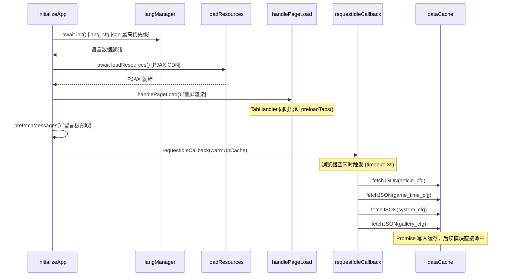

## 用户需求

对网站的预加载功能进行全面强化，消除"HTML 秒切但数据延迟"的体验断层。

## 产品概述

当前网站已实现页签 HTML 预加载（TabHandler），切换页签时 innerHTML 零请求注入。但各页签依赖的 JSON 配置数据（article_cfg、game_time_cfg、system_cfg、gallery_cfg）仍为按需加载，导致用户切换到游戏/画廊/文章页后，需等待 JSON 请求完成才能渲染内容。需要在应用启动阶段，利用浏览器空闲时间预热所有 JSON 数据缓存，实现页签切换后数据立即可用。

## 核心功能

1. **JSON 配置文件预加载**：在 `initializeApp` 中首屏渲染完成后，后台预热 4 个 JSON 配置文件到 dataCache 缓存
2. **复用现有 dataCache 缓存层**：通过调用 `fetchJSON()` 预热缓存 Promise，各模块后续调用直接命中，零代码改动
3. **优先级分层控制**：lang_cfg.json 保持最高优先级（阻塞式 await），JSON 预热在首屏渲染完成后以 `requestIdleCallback` 低优先级执行，不影响首屏性能
4. **统一 previewLoader 的数据获取**：将 previewLoader.js 中独立的 `fetch('/cfg/article_cfg.json')` 改为使用 dataCache.fetchJSON，与预加载缓存打通

## 技术栈

- 原生 JavaScript (ES Module)
- webpack 5 构建
- 现有 dataCache.js 缓存层

## 实现方案

### 整体策略

在现有 `dataCache.js` 的 Promise 缓存机制之上，新增一个 `warmUpCache()` 预热函数，在 `main.js` 的 `handlePageLoad()` 首次执行之后，通过 `requestIdleCallback` 低优先级触发，将 4 个配置 JSON 的 fetch Promise 提前写入缓存 Map。各消费模块（gameList / gallery / previewLoader）后续调用 `fetchJSON()` 时直接命中已有 Promise，无需等待网络。

### 关键技术决策

1. **为什么用 requestIdleCallback 而非直接并发**：

- `langManager.init()` 是阻塞式 await，必须在所有 JSON 预加载之前完成
- 首屏 `handlePageLoad()` 需要立即执行（渲染当前页签内容）
- `requestIdleCallback` 在首屏渲染完成后的空闲时段触发预热，不与 lang_cfg / CDN 资源 / 页签 HTML 预加载抢带宽
- 提供 `timeout: 3000` 兜底，确保即使浏览器持续繁忙也能在 3 秒内启动预热

2. **为什么不修改 dataCache.js 的 fetchJSON 接口**：

- `fetchJSON(url)` 本身就是幂等的（缓存 Promise 而非结果）
- 预热时调用 `fetchJSON(url)` 会将 Promise 写入 cache Map
- 各模块后续调用同一 URL 直接返回已有 Promise，无需任何改动
- gameList.js 和 gallery.js 零改动即可受益

3. **为什么要改造 previewLoader.js**：

- 它是唯一一个使用原生 `fetch()` 而非 `dataCache.fetchJSON()` 的 JSON 消费者
- 不统一就无法享受预热缓存，会产生对 article_cfg.json 的重复请求
- 改造量极小：引入 fetchJSON + 替换一行调用

### 优先级加载时序



## 实现细节

### dataCache.js 扩展

新增 `warmUpCache()` 导出函数，接收 URL 数组，对每个 URL 调用 `fetchJSON()` 触发缓存写入。失败静默处理（预热失败不影响后续按需加载，fetchJSON 的 catch 会清除失败缓存允许重试）。

### main.js 集成

在 `prefetchMessages()` 之后，通过 `requestIdleCallback` 调用 `warmUpCache()`。使用 `typeof requestIdleCallback !== 'undefined'` 检测兼容性，不支持时 fallback 到 `setTimeout(fn, 200)`。

### previewLoader.js 统一

将 `fetchLinks()` 中的 `fetch('/cfg/article_cfg.json')` 替换为 `fetchJSON('/cfg/article_cfg.json')`（从 dataCache.js 导入），消除 article_cfg.json 的重复请求。原有的 `cachedLinks` 模块级变量保留（它缓存的是 transform 后的结果，与 fetchJSON 缓存的原始 JSON 不冲突）。

### 性能与风险控制

- **带宽**：4 个 JSON 均为小文件（KB 级），requestIdleCallback 时机下不影响用户交互
- **兼容性**：Safari 不支持 requestIdleCallback，用 setTimeout 200ms 兜底足够
- **失败容错**：warmUpCache 静默 catch，不影响任何现有功能
- **零回归风险**：gameList.js / gallery.js 完全不改动；previewLoader.js 仅替换 fetch 调用源

## 目录结构

```
js/
├── dataCache.js        # [MODIFY] 新增 warmUpCache(urls) 导出函数，遍历 URL 数组调用 fetchJSON 预热缓存，静默处理失败
├── main.js             # [MODIFY] 导入 warmUpCache，在 prefetchMessages() 之后通过 requestIdleCallback 调用预热 4 个 JSON URL
└── previewLoader.js    # [MODIFY] 引入 dataCache.fetchJSON 替换原生 fetch，统一 article_cfg.json 数据获取通道
```

## 关键代码结构

```js
// dataCache.js - 新增导出
export function warmUpCache(urls) {
    urls.forEach(url => {
        fetchJSON(url).catch(() => {}); // 静默预热，失败不影响后续按需加载
    });
}
```