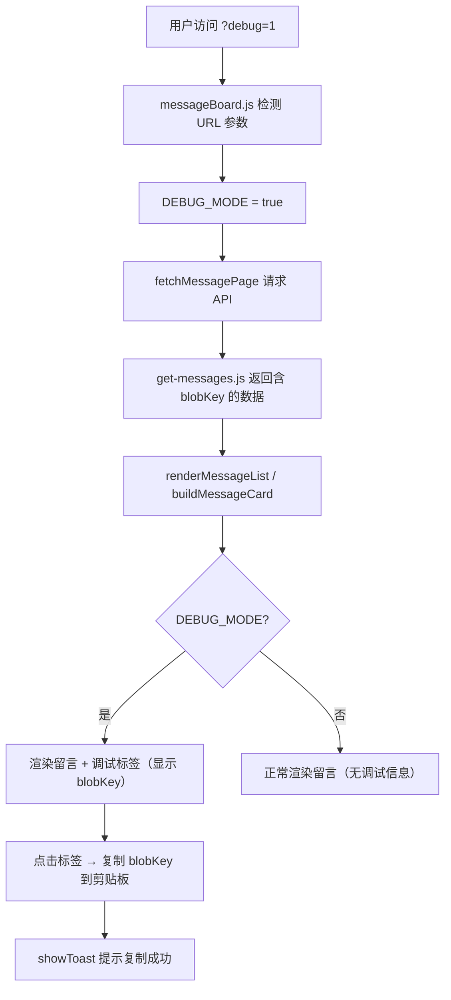

## 用户需求

为留言板添加现网调试模式，通过 URL 参数 `?debug=1` 激活，在每条留言和回复中醒目显示其 Blob Key，方便在 Netlify 后台（UI 或 CLI）快速定位并维护（删除）留言。

## 产品概述

当前留言板数据存储在 Netlify Blobs 中，每条留言对应一个 Blob Key（如 `msg:9999987654321:1711234567-abcdef12`）。用户在 Netlify 后台维护留言时，需要知道完整的 Blob Key 才能定位和删除。目前页面不显示任何可用于后台维护的标识信息，只能在 Netlify Blobs UI 中逐一查找，效率低下。

## 核心功能

1. **调试模式激活**：在现网访问 `/page/message.html?debug=1` 时激活调试模式，页面正常显示的同时附加调试信息
2. **Blob Key 显示**：每条主留言和每条回复/评论下方都醒目显示其完整 Blob Key，可直接用于 `netlify blobs:delete guestbook "key"` 命令
3. **一键复制**：点击 Blob Key 标签可一键复制到剪贴板，复制后有视觉反馈
4. **非调试模式无影响**：不带 `?debug=1` 参数时，页面表现与现有完全一致，无任何多余渲染或数据开销

## 技术栈

- 后端：Netlify Functions (Node.js) + `@netlify/blobs`
- 前端：原生 JavaScript (ES Module)，Webpack 打包
- 样式：纯 CSS，Windows 98 复古风格设计系统

## 实现方案

### 核心思路

分为后端和前端两层改动：

1. **后端**：修改 `get-messages.js`，在遍历 blobs 时将 `blob.key` 写入每条 entry 的 `blobKey` 字段，随 API 响应一起返回。这是最可靠的方式，因为 blob key 是在写入时由 `post-message.js` 生成的，直接从 `store.list()` 获取的 `blob.key` 是真实的存储键，不存在重建误差。

2. **前端**：在 `messageBoard.js` 中参考已有的 `USE_MOCK_MESSAGES` 模式，添加 `DEBUG_MODE` 标志（通过 `?debug=1` URL 参数激活）。在 `buildMessageCard` 函数中，当 debug 模式开启时，为每条主留言和回复额外渲染一个调试信息标签，显示完整 Blob Key 并支持点击复制。

3. **样式**：在 `css/message.css` 中添加调试标签的样式，使用醒目的颜色（如红色底/白字的 monospace 标签），与 Win98 风格协调。

### 关键技术决策

**为什么让后端返回 blobKey 而不是前端重建？**

- Blob key 格式为 `msg:{reverseTs}:{id}`，其中 `reverseTs = String(9999999999999 - timestamp).padStart(13, '0')`
- 虽然理论上可以通过 `id` 和 `created_at` 前端重建，但 `id` 中的时间戳和 `created_at` 可能存在毫秒偏差（后端 normalizeEntry 可能修改时间），重建不可靠
- 后端 `store.list()` 已经拿到了 `blob.key`，附加到返回数据中零成本

**为什么不用 `__DEV__` 守卫 debug 代码？**

- `__DEV__` 在生产构建时为 false，Terser 会移除相关代码
- 但 debug 模式恰恰需要在**生产环境（现网）**工作，因此必须用运行时 URL 参数判断，不能用编译时常量

**性能影响分析**

- 后端：每条 entry 多返回一个 ~50 字符的 `blobKey` 字符串，对 JSON 大小几乎无影响（20 条留言约多 1KB）
- 前端：debug 标志为运行时常量，非 debug 模式下 `buildMessageCard` 中的 if 分支直接跳过，无多余 DOM 操作

## 实现要点

### 后端修改（get-messages.js）

- 在 `loaded = await Promise.all(blobs.map(...))` 中，将 `blob.key` 传入 `normalizeEntry` 并赋值到返回对象的 `blobKey` 字段
- 这样每条 item 都会携带 `blobKey`，前端在 debug 模式下直接读取

### 前端修改（messageBoard.js）

- 模块顶部新增 `DEBUG_MODE` 常量，参考已有的 `USE_MOCK_MESSAGES` 模式，读取 `?debug=1` 参数
- `buildMessageCard` 中：当 `DEBUG_MODE` 为 true 时，在主留言的 `.message-card-body` 之后插入调试标签 `<div class="msg-debug-tag">`，显示 `item.blobKey`，绑定点击复制事件
- 回复列表渲染中：同理在每条 `.message-reply-body` 之后插入调试标签，显示 `reply.blobKey`
- 点击复制使用 `navigator.clipboard.writeText()`，成功后用已有的 `showToast()` 提示

### 样式修改（css/message.css）

- `.msg-debug-tag`：monospace 字体、小号字、醒目的红色/橙色背景色、白色文字、cursor: pointer
- 确保与 Win98 复古风格一致（使用已有的 CSS 变量如 `--color-error`、`--font-ui`）

## 架构设计



## 目录结构

```
f:\Emanon\
├── netlify/functions/
│   └── get-messages.js    # [MODIFY] 在 blobs.map 遍历中将 blob.key 附加到 entry 对象的 blobKey 字段
├── js/
│   └── messageBoard.js    # [MODIFY] 添加 DEBUG_MODE 检测；在 buildMessageCard 的主留言和回复渲染中条件插入调试标签；添加点击复制逻辑
└── css/
    └── message.css        # [MODIFY] 添加 .msg-debug-tag 调试标签样式（醒目颜色、monospace、可点击、移动端适配）
```