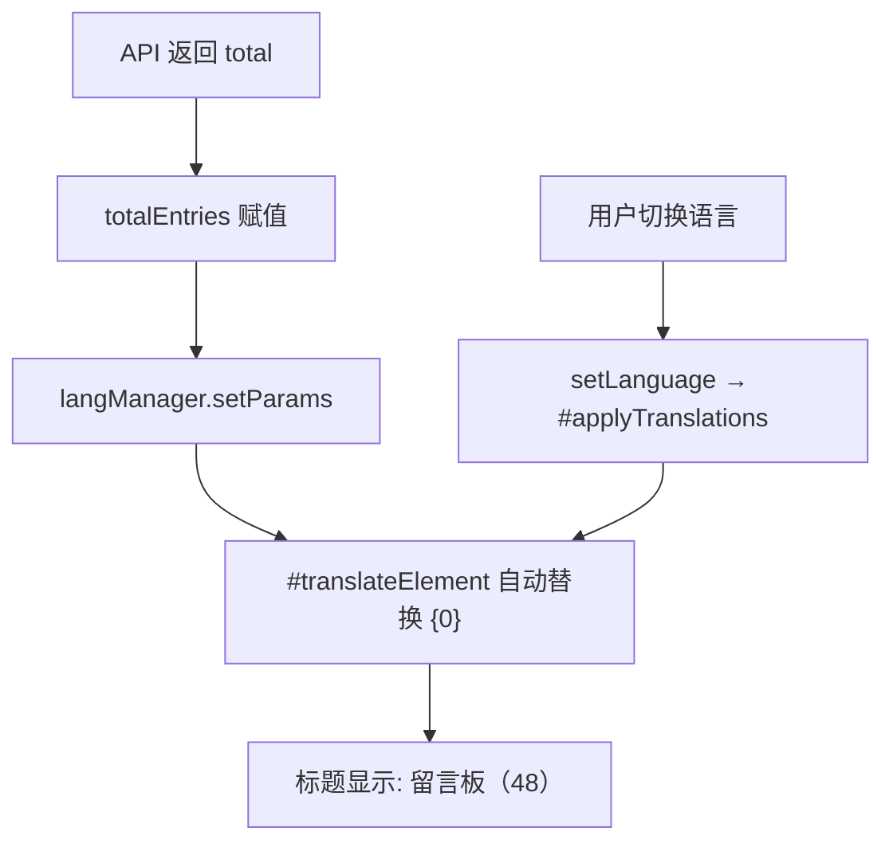

## 用户需求

将留言板的"留言列表"标题文本修改为带留言总数显示，格式为"留言板（{0}）"，其中 `{0}` 传入留言总数（含回复）。

## 产品概述

在留言板区域的列表标题中展示当前留言总数（含主留言和评论回复），让用户直观了解留言板的活跃程度。

## 核心功能

- 留言列表标题从静态文本"留言列表"改为动态文本"留言板（48）"，括号中数字为留言总数
- 支持三语言自动适配：中文"留言板（{0}）"、英文"Message Board ({0})"、日文"メッセージボード（{0}）"
- 数据加载完成后自动更新数字，语言切换后自动以新语言重新渲染带数字的标题

## 技术栈

- 现有项目技术栈：原生 JavaScript + EJS 模板 + Webpack 构建
- 多语言系统：自研 `langManager`，支持 `{0}` 占位符替换和 `dynamicParams` 动态参数机制

## 实现方案

### 策略

利用 `langManager` 已有的 `setParams(id, params)` API 实现动态参数注入。该方法会将参数存入 `dynamicParams` Map，并自动触发对应 `data-lang-id` 元素的重新翻译。语言切换时，`#applyTranslations()` 内部会自动读取 `dynamicParams` 中的参数进行占位符替换，无需额外监听。

### 核心流程

1. 修改 `lang_cfg.json` 中 `msg_list_title` 的三语言文本，加入 `{0}` 占位符
2. 在 `messageBoard.js` 中，每次数据加载完成后调用 `langManager.setParams('msg_list_title', [totalEntries])` 更新标题
3. EJS 模板中的 `<span data-lang-id="msg_list_title">` 保持不变，`langManager` 的 `#translateElement` 会自动合并 `dynamicParams` 并替换占位符

### 关键技术决策

- **使用 `setParams` 而非 `applyParameters`**：`setParams` 将参数持久存储在 `dynamicParams` Map 中，语言切换时 `setLanguage()` 方法（第 326-338 行）会遍历 `dynamicParams` 将对应元素加入待更新队列，确保切换语言后标题自动更新为新语言的带数字文本。`applyParameters` 虽然也能设置，但 `setParams` 更轻量且语义更明确。
- **保留 `data-lang-id` 属性**：无需修改 EJS 模板，`langManager` 的 DOM 翻译机制（`#translateElement` 第 158-165 行）已支持从 `dynamicParams` 读取参数并替换 `{0}` 占位符。
- **`total` 字段已包含回复数**：后端 `get-messages.js` 第 70 行 `sorted.length` 包含主留言和回复，前端 `totalEntries` 直接使用该值，无需后端改动。

## 实现备注

### 更新时机

`messageBoard.js` 中有三处设置 `totalEntries` 的路径，都需要在之后调用 `setParams`：

1. `initializeMessageBoard()` 第 98 行（预取缓存命中）→ 第 100-101 行之后
2. `initializeMessageBoard()` 第 108 行（预取 Promise 完成）→ 第 110-111 行之后  
3. `loadMessages()` 第 232 行（正常加载）→ 第 235-236 行之后

为避免重复代码，抽取一个 `updateListTitle()` 辅助函数，在这三处统一调用。

### 边界情况

- 加载中/加载失败时：`totalEntries` 保持上次值（初始为 0），标题显示"留言板（0）"，符合预期
- 语言切换：`setParams` 存储的参数持久有效，`langManager.setLanguage()` 自动重新翻译，无需额外处理

## 架构设计

数据流无变化，仅在渲染层增加标题更新逻辑：



## 目录结构

```
f:/Emanon/
├── cfg/
│   └── lang_cfg.json          # [MODIFY] 修改 msg_list_title 的 cn/en/jp 文本，加入 {0} 占位符
├── js/
│   └── messageBoard.js        # [MODIFY] 新增 updateListTitle() 辅助函数，在三处数据加载完成点调用 langManager.setParams
└── ejs/
    └── pages/message.ejs      # [无需修改] data-lang-id="msg_list_title" 保持不变
```