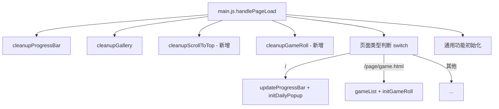

## 用户需求

对 Emanon 项目评审报告中的 P0（6项必须立即修复）和 P1（7项显著提升性能和可维护性）问题执行全面修复。

## 产品概述

Emanon 是一个 Windows 98 复古风格个人网站，采用 webpack 5 构建、Netlify 部署、SPA 化页签切换 + PJAX 导航。本次修复覆盖安全漏洞、崩溃 Bug、HTML 结构错误、部署配置缺失、内存泄漏、代码重复等 11 项问题。

## 核心特性

- P0-1：修复 scrollToTop.js 崩溃风险和内存泄漏，添加 throttle 和 cleanup 机制
- P0-2：修复 dailyPopup.js 弹窗间隔配置错误（1秒→24小时）和 closePopup 逻辑 Bug
- P0-3：修复所有 EJS 模板中 6 个 HTML 元素位于 body 外的结构错误 + game.ejs 重复 ID
- P0-4/P0-5：补全 netlify.toml 安全头和统一构建命令
- P0-6：修复 previewLoader.js 的 XSS 注入风险
- P1-2：提取 6 组重复工具函数到 utils.js
- P1-3：统一 progressBar.js 中 langManager 引用方式
- P1-4：为 gameRoll.js 添加 cleanup 机制并在 main.js 统一调用
- P1-6/P1-7：修复 CSS will-change 非标准值和 transition: all 性能陷阱

## 技术栈

- 原生 JavaScript（ES Module）
- Webpack 5（构建打包）
- EJS（HTML 模板）
- CSS（无预处理器）
- Netlify（部署 + Serverless Functions）

## 实现方案

本次修复涵盖 11 项问题，按文件关联性分为 9 个执行步骤。所有修改遵循项目现有代码风格和架构模式，不引入新依赖。

### 关键技术决策

**P0-1 scrollToTop.js 重写策略**：完全重写为初始化函数 + cleanup 函数模式（与项目中 progressBar.js/gallery.js 的 cleanup 模式一致）。scroll 事件使用简单的时间戳 throttle（100ms），不引入外部库。

**P0-2 dailyPopup.js closePopup 重构**：将 function 声明的 `closePopup` 改为模块级 `let closeHandler = null`，在 `initPopup` 中赋值增强版闭包函数。`window.closePopup` 改为调用 `closeHandler`。

**P0-3 EJS 模板修复顺序**：先修改 7 个 pages/*.ejs（将 function.ejs include 移入 body 内），再删除 game.ejs 多余的 #tips 元素。

**P1-2 getLocalizedField 签名改造**：原函数内部调用 `langManager.getCurrentLang()` 获取语言，迁移到 utils.js 后改为接收 `lang` 参数（避免 utils.js 引入 langManager 依赖），调用处传入 `langManager.getCurrentLang()`。

**P1-4 gameRoll cleanup 方案**：由于 initGameRoll 是闭包函数，改造为返回 cleanup 函数。main.js 保存返回的 cleanup 引用，在 handlePageLoad 开头调用。

## 实现备注

- CRT 效果（crtEffect.js）不做任何修改，仅 CSS 层面移除无效的 `will-change: contents`，不影响画面表现
- 所有 cleanup 函数遵循幂等原则（多次调用不报错）
- post/_src/template.html 已将 6 个功能元素放在 body 内，无需修改
- 404.html 的 canvas 也在 body 内，无需修改

## 架构设计

### 模块 Cleanup 机制（修复后）



## 目录结构

```
f:/Emanon/
├── netlify.toml                    # [MODIFY] P0-4/P0-5: 安全头 + 构建命令
├── ejs/
│   ├── templates/
│   │   └── function.ejs            # [不修改] 内容不变，只是 include 位置移入 body
│   └── pages/
│       ├── about.ejs               # [MODIFY] P0-3: include 位置从 </body> 后移到 </body> 前
│       ├── article.ejs             # [MODIFY] P0-3: 同上
│       ├── gallery.ejs             # [MODIFY] P0-3: 同上
│       ├── game.ejs                # [MODIFY] P0-3: 同上 + 删除重复 #tips 元素
│       ├── index.ejs               # [MODIFY] P0-3: 同上
│       ├── message.ejs             # [MODIFY] P0-3: 同上
│       └── password.ejs            # [MODIFY] P0-3: 同上
├── js/
│   ├── scrollToTop.js              # [MODIFY] P0-1/P1-4: 完全重写，添加 null guard/throttle/cleanup
│   ├── dailyPopup.js               # [MODIFY] P0-2: 修复 interval/closePopup/自执行
│   ├── previewLoader.js            # [MODIFY] P0-6: 添加 XSS 转义
│   ├── utils.js                    # [MODIFY] P1-2: 新增 getSystemValue/getLocalizedField/normalizeGameData/parseKeys/parseConfigString/shuffleArray
│   ├── gameList.js                 # [MODIFY] P1-2: 删除本地工具函数，改为从 utils.js import
│   ├── gameRoll.js                 # [MODIFY] P1-2/P1-4: 删除本地工具函数 + 添加 cleanup 机制
│   ├── gallery.js                  # [MODIFY] P1-2: 删除本地 getSystemValue，改为从 utils.js import
│   ├── progressBar.js              # [MODIFY] P1-3: 添加 import langManager，替换全局 LangManager
│   ├── main.js                     # [MODIFY] P1-4: handlePageLoad 添加 cleanupScrollToTop/cleanupGameRoll 调用，保存 gameRoll cleanup 引用
├── css/
│   ├── style.css                   # [MODIFY] P1-6: 移除 .crt-effect 的 will-change: contents
│   └── game.css                    # [MODIFY] P1-7: #gameResult transition: all → transition: height
```