## 产品概述

优化 Emanon 网站（Windows 98 复古风格个人站）在 5 个主页签（进度/文章/游戏/画廊/留言）之间切换时的页面加载速度，目标是做到丝滑无感的即时切换体验。

## 核心特性

- 消除页签切换时 Tab 栏的销毁重建闪烁，Tab 栏始终保持在 DOM 中不被替换
- 缩小页签缓存的 innerHTML 范围，只缓存和替换真正变化的内容区域，而非整个 `#main`
- 将多语言翻译从全文档扫描优化为增量翻译，仅处理新注入的内容区域
- 避免 Footer 每次切换时的销毁重建，改为缓存复用
- 整体将页签切换时 `handlePageLoad` 的同步阻塞工作量降到最低

## 技术栈

- 前端：原生 JavaScript（ES Module）+ EJS 模板 + Webpack 5 打包
- SPA 化方案：PJAX + TabHandler 内存缓存 + history.pushState
- 构建：webpack.config.js + HtmlWebpackPlugin（EJS→HTML）

## 实现方案

### 核心策略：缩小替换粒度 + 消除重复工作

当前切换流程的主要延迟来自三个层面：

1. **DOM 替换范围过大**：缓存整个 `#main` 的 innerHTML，替换时 Tab 栏被销毁需重建
2. **全文档翻译扫描**：`langManager.applyTranslations()` 每次 `querySelectorAll` 遍历整个 document
3. **Footer 反复销毁重建**：每次切换删除旧 footer 再插入新 footer

优化策略是将 Tab 栏从替换区域中"隔离"出来，缩小缓存/替换的粒度到 `.window[role="tabpanel"]` 层级，并将翻译范围限定到新注入的子树。

### 关键技术决策

**决策 1：将 Tab 栏移出 PJAX 替换区域**

当前 HTML 结构：

```
#main > .window-body > menu[role="tablist"] + .window[role="tabpanel"]
```

Tab 栏在 `#main` 内，PJAX 替换 `#main` 时会销毁 Tab 栏。

方案：在 `handleTabClick` 中不替换整个 `#main.innerHTML`，而是只替换 `#main` 内除 tablist 之外的内容区域。具体做法：

- 修改 `TabHandler.htmlCache` 的缓存粒度：从缓存整个 `#main.innerHTML` 改为只缓存 `#main` 中**去掉第一层 `.window-body > menu[role="tablist"]` 后**的内容（即 `.window-body` 内 tablist 之后的所有兄弟节点）
- 切换时：保留当前 tablist DOM 不动，仅替换 tablist 后面的兄弟内容
- `preloadTabs` 预加载的 HTML 同样只提取内容区域部分

这样 Tab 栏始终留在 DOM 中，无需 `refreshTabHandler()` 每次 `new TabHandler()`。

**决策 2：为 PJAX 路径保持兼容**

PJAX 仍使用 `selectors: ['head title', '#main']` 替换整个 `#main`（文章详情页等非页签页面走此路径）。只有页签间的缓存切换采用细粒度替换。`pjax:complete` 事件时仍走完整的 `handlePageLoad`（包括 `refreshTabHandler`），保持 PJAX 路径不变。

**决策 3：增量翻译替代全文档扫描**

为 `langManager` 新增 `applyTranslationsIn(rootEl)` 方法，仅在指定 DOM 子树内执行 `querySelectorAll('[data-lang-id]')`，替代现有的全文档 `applyTranslations()`。Tab 缓存切换路径调用此增量方法；PJAX 路径仍走全文档翻译。

同时，`#safeBindSwitcher()` 中的 `cloneNode + replaceChild` 在 Tab 切换路径中跳过（lang-switcher 只在 dailyPopup 中存在，且 dailyPopup 只在首页 24h 间隔弹出，Tab 切换无需每次重建）。

**决策 4：Footer 缓存复用**

为 `footerLoader` 添加模块级 HTML 缓存。同一页面类型（post vs 非 post）的 footer HTML 模板只生成一次，后续切换时：

- 检测 `.window-footer` 是否已存在于当前内容中（缓存的 HTML 已包含 footer）
- 如已存在则只更新动态数据（GitHub 更新时间），不销毁重建 DOM

**决策 5：`refreshTabHandler` 改为轻量 `updateOnly` 模式**

将 `refreshTabHandler` 拆分为两个路径：

- **首次初始化 / PJAX 完整替换**：走现有逻辑（`new TabHandler`）
- **Tab 缓存切换**：只调用 `currentTabHandler.updateSelectedTab(url)`，不重建

### 性能分析

优化前 Tab 切换的同步工作：

```
innerHTML 替换整个 #main        → 重排重绘（大）
refreshTabHandler: new TabHandler → DOM 查询×3 + innerHTML 写入 + 事件绑定 + querySelectorAll
footerLoader: 销毁 + 重建       → querySelectorAll + remove + insertAdjacentHTML
applyTranslations: 全文档扫描    → querySelectorAll(整个 document) + 逐元素 innerHTML
safeBindSwitcher: cloneNode      → cloneNode + replaceChild（无意义，switcher 不存在）
```

优化后 Tab 切换的同步工作：

```
innerHTML 替换内容区域            → 重排重绘（小，不含 tablist）
updateSelectedTab: 5个 classList → 极轻
footerLoader: 跳过（已在缓存中） → 零开销
applyTranslationsIn(contentEl)   → querySelectorAll 仅限内容子树
safeBindSwitcher: 跳过           → 零开销
```

预期效果：Tab 切换的同步 JS 执行时间减少 60-80%，DOM 操作范围大幅缩小，视觉上做到无闪烁即时切换。

## 实现细节

### 1. TabHandler 缓存粒度改造

核心变更在 `tabHandler.js`：

- `cacheCurrentPage()`：改为缓存 `#main` 内除 tablist 外的内容。具体实现：获取 `.window-body` 下 tablist 之后的所有兄弟元素的 `outerHTML` 拼接（主要是 `.window[role="tabpanel"]`，gallery 页还有 `#imageModal`）
- `handleTabClick()`：缓存命中时，不替换 `main.innerHTML`，而是：

1. 找到 `menu[role="tablist"]`
2. 移除 tablist 之后的所有兄弟节点
3. 将缓存内容通过 `insertAdjacentHTML('beforeend', cached)` 插入到 `.window-body` 中 tablist 之后

- `preloadTabs()`：提取时同样只取内容区域

- 新增静态方法 `TabHandler.getContentHtml(mainEl)`：统一提取内容区域 HTML 的逻辑
- 新增静态方法 `TabHandler.replaceContent(mainEl, html)`：统一替换内容区域的逻辑

### 2. main.js handlePageLoad 分路径

- 新增参数 `handlePageLoad(isTabSwitch = false)`
- `isTabSwitch = true` 时（从 TabHandler 缓存切换调用）：
- 跳过 `refreshTabHandler()`，只调 `currentTabHandler.updateSelectedTab(url)`
- 页面特定初始化照常执行
- 通用功能中 `footerLoader` 改为条件执行（检测 footer 是否已存在）
- `langManager.applyTranslations()` 改为 `langManager.applyTranslationsIn(contentRoot)`
- 跳过 `initCRT()`（单例已初始化）
- `isTabSwitch = false` 时（PJAX complete / popstate fallback）：走现有完整逻辑

### 3. langManager 增量翻译

- 新增公共方法 `applyTranslationsIn(rootElement)`：

```
rootElement.querySelectorAll('[data-lang-id], [data-lang-placeholder]')
```

只扫描指定子树，不触发 `#safeBindSwitcher()`

- 现有 `applyTranslations()` 保持不变（PJAX 路径和语言切换仍需全文档扫描）

### 4. footerLoader 优化

- 添加模块级检测：如果当前 `#main .window[role="tabpanel"] .window-footer` 已存在，则跳过 DOM 重建
- 仅在 footer 不存在时（首次加载 / PJAX 替换后）执行完整的 footer 创建逻辑
- GitHub API 时间更新改为仅在时间元素内容为空时触发

### 5. popstate 处理兼容

`main.js` 中 popstate handler 也需要使用新的细粒度替换逻辑：

- 缓存命中时调用 `TabHandler.replaceContent()` 而非 `main.innerHTML = cached`
- 传入 `isTabSwitch = true` 调用 `handlePageLoad`

### 6. EJS 模板不需要修改

所有 EJS 模板保持不变。HTML 结构不变，缓存提取/替换逻辑在 JS 侧处理。PJAX 选择器不变（`['head title', '#main']`），非页签页面（文章详情等）走 PJAX 时仍替换整个 `#main`，不受影响。

## 架构设计

### Tab 切换优化前后对比

```mermaid
flowchart TD
    subgraph Before["优化前：Tab 切换流程"]
        B1[点击页签] --> B2["main.innerHTML = cached<br/>(替换整个 #main)"]
        B2 --> B3["refreshTabHandler()<br/>销毁 + new TabHandler"]
        B3 --> B4[页面特定初始化]
        B4 --> B5["footerLoader()<br/>销毁 + 重建 footer"]
        B5 --> B6["applyTranslations()<br/>全文档 querySelectorAll"]
        B6 --> B7["safeBindSwitcher()<br/>cloneNode 重建"]
    end

    subgraph After["优化后：Tab 切换流程"]
        A1[点击页签] --> A2["replaceContent(cached)<br/>(只替换内容区域，保留 Tab 栏)"]
        A2 --> A3["updateSelectedTab()<br/>仅更新 5 个 classList"]
        A3 --> A4[页面特定初始化]
        A4 --> A5["footerLoader()<br/>检测已存在则跳过"]
        A5 --> A6["applyTranslationsIn(contentEl)<br/>仅扫描内容子树"]
    end

    style B2 fill:#ffcccc
    style B3 fill:#ffcccc
    style B5 fill:#ffeecc
    style B6 fill:#ffcccc
    style B7 fill:#ffcccc
    style A2 fill:#ccffcc
    style A3 fill:#ccffcc
    style A5 fill:#ccffcc
    style A6 fill:#ccffcc
```



## 目录结构

```
f:\Emanon\
├── js/
│   ├── tabHandler.js    # [MODIFY] 核心改造：缓存粒度从 #main 缩小到内容区域；新增 getContentHtml / replaceContent 静态方法；handleTabClick 改为细粒度替换不销毁 tablist；cacheCurrentPage / preloadTabs 只缓存内容区域
│   ├── main.js          # [MODIFY] handlePageLoad 增加 isTabSwitch 参数分路径执行；Tab 切换路径跳过 refreshTabHandler / initCRT / safeBindSwitcher；popstate handler 改用细粒度替换；refreshTabHandler 仅在 PJAX 路径调用
│   ├── langManager.js   # [MODIFY] 新增 applyTranslationsIn(rootElement) 公共方法，仅扫描指定子树内的 data-lang-id 元素进行翻译，不触发 safeBindSwitcher
│   └── footerLoader.js  # [MODIFY] 新增 footer 存在性检测，已存在时跳过 DOM 重建；仅在 footer 不存在时执行完整创建逻辑
```

## Agent Extensions

### SubAgent

- **code-explorer**
- 用途：在实现各步骤时，验证修改是否影响到其他引用了 TabHandler.htmlCache / main.innerHTML / applyTranslations 的代码路径
- 预期结果：确保所有引用点（popstate handler、pjax:complete、bindGlobalPjaxNavigation 等）都正确适配新的缓存粒度