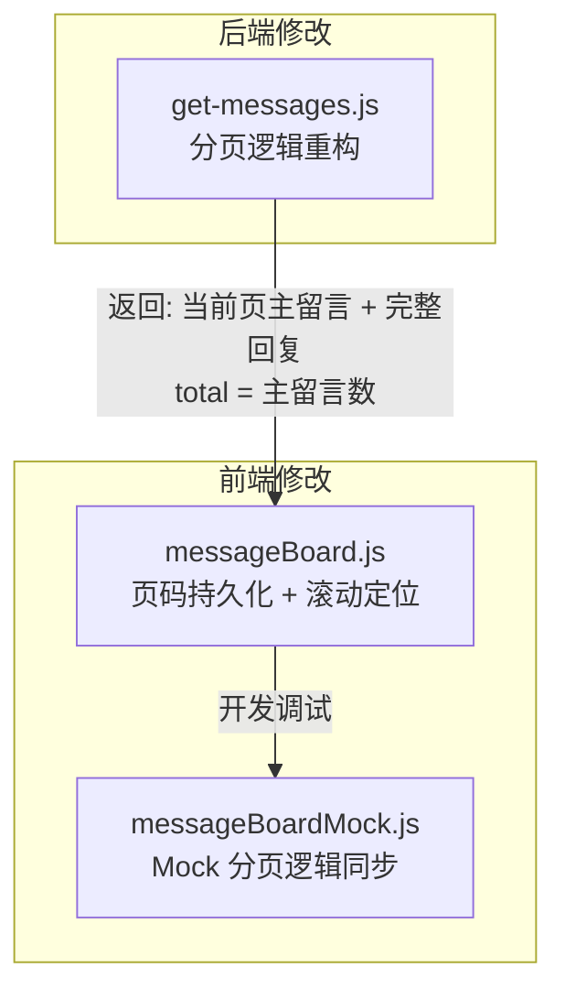

## 用户需求

修复留言板在现网存在的两个 bug。

## 产品概述

Emanon 是一个 Windows 98 复古风格个人网站，留言板模块基于 Netlify Blobs 存储，支持用户留言和回复评论，带有分页浏览功能。

## 核心功能（Bug 修复）

### Bug 1：留言回复显示不全

- 现象：某条留言的回复有可能显示不全，新增的回复看不到，但最早的一条回复会被顶上来
- 原因：后端 `get-messages.js` 将主留言和回复混在一起按时间排序后做扁平分页切割，导致同一条主留言的多条回复散布在不同分页中，前端只能看到当前页内的回复
- 修复目标：后端应先分离主留言和回复，仅对主留言做分页，然后将当前页主留言对应的所有回复一并返回；`total` 字段应返回主留言总数（而非全部条目数），以便前端正确计算总页数

### Bug 2：回复后刷新页面丢失位置

- 现象：在第二页回复留言后刷新页面，会自动回到第一页，无法保持在之前浏览的位置
- 原因：回复提交后硬编码 `loadMessages(1)` 跳回第一页；`initializeMessageBoard()` 初始化也硬编码 `currentPage = 1`；没有任何页码持久化机制
- 修复目标：
- 回复提交后保持当前页加载（`loadMessages(currentPage)`），并自动滚动定位到所回复的留言卡片
- 使用 `sessionStorage` 持久化当前页码和目标留言 ID，页面刷新/重新进入留言板时自动恢复页码并滚动到目标位置
- 主留言提交后仍跳回第一页（新留言出现在最前面，符合预期）

## 技术栈

- 后端：Node.js（Netlify Functions）+ Netlify Blobs 存储
- 前端：原生 JavaScript（ES Module），webpack 5 打包
- 部署：Netlify

## 实现方案

### Bug 1：后端分页逻辑重构

**策略**：在 `get-messages.js` 中，先将所有条目分为主留言和回复两组，仅对主留言按时间倒序分页，然后收集当前页主留言的所有回复一并返回。

**具体做法**：

1. 加载全部 blobs 后，遍历 `loaded` 数组，按 `isReply` / `replyTo` 字段分离为 `messages`（主留言）和 `replies`（回复）
2. `messages` 按 `created_at` 倒序排列，对 `messages` 做 `slice(start, end)` 分页
3. 收集当前页所有主留言的 `messageId`，构建 Set
4. 从 `replies` 中筛选 `replyTo` 在该 Set 中的回复
5. 将当前页主留言 + 对应回复合并为 `items` 返回
6. `total` 返回 **主留言总数**（非全部条目数），前端才能正确计算分页

**关键决策**：

- 回复不参与分页计数，这确保了无论一条留言有多少回复，分页行为都是稳定的
- 前端 `renderMessageList()` 的分离逻辑无需修改，因为后端返回的数据已经是「当前页主留言 + 其完整回复」
- 前端 `totalEntries` 语义从「全部条目」变为「主留言总数」，`updateListTitle` 展示的数字也自然变为主留言数，更符合用户认知

### Bug 2：页码持久化与滚动定位

**策略**：使用 `sessionStorage` 存储当前页码和目标滚动留言 ID，回复提交后保持当前页，页面刷新时恢复状态。

**具体做法**：

1. **新增两个 sessionStorage key**：

- `msg_current_page`：当前页码
- `msg_scroll_target`：需要滚动定位的留言 messageId（一次性使用后清除）

2. **回复提交后**（`buildReplyComposer` 内 submit handler，第 576 行）：

- `loadMessages(1)` 改为 `loadMessages(currentPage)`
- 提交成功后将 `currentPage` 和被回复的 `messageId` 写入 sessionStorage
- 数据加载完成后滚动到对应 `.message-card[data-message-id]` 元素

3. **主留言提交后**（`bindFormEvents` 内 submit handler，第 179 行）：

- 保持 `loadMessages(1)` 不变（新留言在第一页顶部）
- 清除 sessionStorage 中的页码缓存

4. **`initializeMessageBoard()` 恢复逻辑**：

- 读取 `sessionStorage.getItem('msg_current_page')`，若存在则恢复页码
- 预取缓存仅对第 1 页有效，若恢复页码不为 1 则走 `loadMessages(page)` 路径
- 数据加载完毕后检查 `msg_scroll_target`，若存在则滚动到目标留言并清除

5. **翻页时同步更新** sessionStorage 页码（`goToPage` 函数中）

6. **新增 `scrollToMessage(messageId)` 辅助函数**：

- 查找 `.message-card[data-message-id="${messageId}"]`
- 使用 `scrollIntoView({ behavior: 'smooth', block: 'center' })` 定位
- 可选：短暂高亮闪烁效果标识目标留言

## 实现注意事项

1. **向后兼容**：后端返回的 `items` 数组结构不变（仍是扁平条目列表），前端 `renderMessageList` 的分离逻辑保持不变，改动影响面最小
2. **预取缓存兼容**：预取仍只缓存第 1 页数据；恢复到非第 1 页时跳过预取缓存，直接走 `loadMessages(page)`
3. **Mock 数据同步**：`messageBoardMock.js` 的 `getMockPageData` 需要同步调整分页逻辑（先分离主留言再分页），保证开发调试一致
4. **sessionStorage 生命周期**：关闭标签页后自动清除，避免跨会话残留；SPA Tab 切换离开留言板时不清除（刷新仍能恢复）
5. **边界情况**：恢复的页码超出实际总页数时（如其间有留言被删），自动回退到最后一页

## 架构设计

修改范围清晰，仅涉及后端 1 个文件 + 前端 2 个文件，不影响其他模块：



## 目录结构

```
f:\Emanon\
├── netlify/functions/
│   └── get-messages.js          # [MODIFY] 重构分页逻辑：分离主留言/回复，仅对主留言分页，
│                                #          收集当前页主留言的所有回复附加返回，total 改为主留言总数
├── js/
│   ├── messageBoard.js          # [MODIFY] 1) initializeMessageBoard 增加 sessionStorage 页码恢复逻辑
│   │                            #          2) 回复提交后 loadMessages(currentPage) 替代 loadMessages(1)
│   │                            #          3) goToPage / loadMessages 增加 sessionStorage 同步写入
│   │                            #          4) 新增 scrollToMessage() 辅助函数，渲染后自动定位
│   │                            #          5) 主留言提交后清除 sessionStorage 页码
│   └── messageBoardMock.js      # [MODIFY] getMockPageData 同步改为主留言优先分页逻辑，
│                                #          确保开发调试数据结构与后端一致
```

## Agent Extensions

### SubAgent

- **code-explorer**
- 用途：在实施过程中若需要确认 `main.js` 中 SPA 导航与 hash 的交互细节、或确认 `sessionStorage` 在项目其他模块中的使用模式，可通过此子代理快速搜索验证
- 预期结果：确认实现方案不与现有导航/状态管理冲突